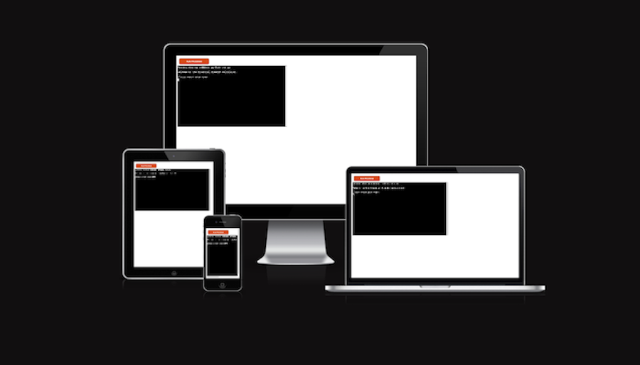
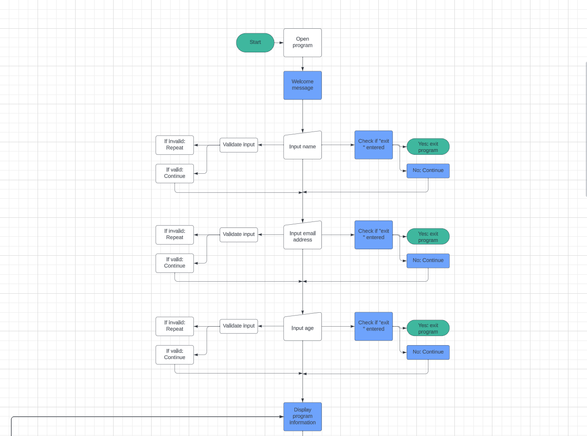
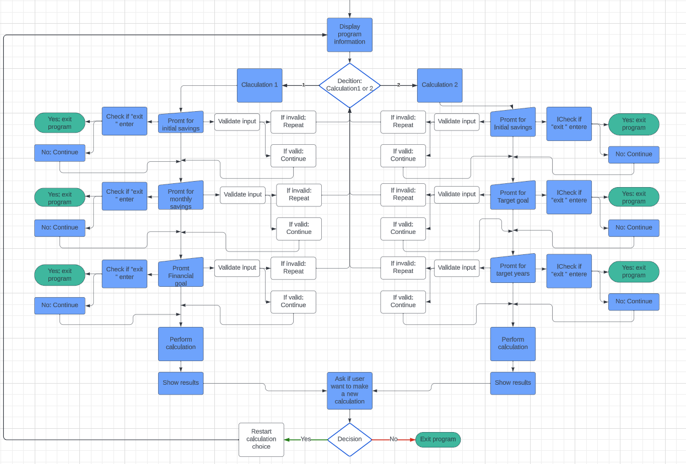

# Financial Freedom Calculator

[Financial Freedom Calculator](https://github.com/Annibor/financial-freedom-calc)

# Introduction

Welcome to Financial Freedom Calculator! This is a python program designed to assist users in planning their financial journey an dgoals. This calculator provides two main functionalities:

1. **Calculate Years Until Financial Freedom:** This determine the number of years it takes to reach financial frredom based on the users initial savings, monthly savings and their financial goals. 
2. **Calculate Required Monthly Savings:** This calculates the monthly savings needed to achive the users financial goal within the specified time frame the user have choosen.

## Table of Content

- [**Financial Freedom Calculator**](#financial-freedom-calculator)
  - [**Table of Content**](#table-of-content)
  - [**Planning & development**](#planning--developmnet)
    - [**Project Goals**](#project-goals)
    - [**Future Features**](#future-features)
  - [**Testing**](#testing)
  - [**Devtools**](#devtools)
  - [**Deployment**](#deployment)
  - [**Languages**](#languages)
  - [**Software**](#software)
  - [**Usage**](#usage)
  - [**Modification**](#modification)
  - [**Distribution**](#distrubition)
  - [**Private Use**](#private-use)
  - [**Liability**](#liability)
  - [**Credits**](#credits)
  - [**Content**](#content)
  - [**Special thanks**](#special-thanks)
  - [**What I've learned**](#what-ive-learned)

## Planning & developmnet

### Project Goals

The primary goals for the Financial Freedom Calculator are to:
- Provide users with a tool to calculate the number of years required to achive financial freedom.
- Assist the user in determining the monthly savings needed to reach financial freedom within a certain period of time.

#### As a General user

- Recive clear instructions for using the calculator.
- Easily understand the pourpose and benefits of the calculator.

#### As a New User

- Understand the outcomes of calculations.
- Recive infomation about each step in the calculation.

### Project Flowchart

- **Overview**:
  - The project's flowchart is presented through two distinct images. This decision was made to enhance readability, avoiding the challenge of deciphering a large, unwieldy image.

- **Clarification on "Display Program Information"**:
  - The element "Display Program Information" is intentionally depicted in both the first and second images. This redundancy serves the purpose of facilitating a seamless understanding of how the flowchart components come together. It's essential to note that, in reality, there is only one occurrence of "Display Program Information" in the overall flowchart.

- 
- 

### Features

- **Years to Financial Freedom Calculation**:
  - Input your intiial savings, monthly savings and financial goal.
  - The calculator will provide the num,ber of years required to achive financial freedom for the user.
  - 

- **Required Monthly Savings Calculation**:
  - Input initial savings, target financial goals and the desired time frame. 
  - The calculator will determine the monthly savings needed to reach the users financial goal.

- **Exit**: 
  -The calculator will exit the program if user enters 'exit' in any of the inputs within the calculator. 

- **Option to rerun a calculation**: 
  - When a calculation is done, the calculator will ask the user if it would like to make another calculation. 
     - If yes, the user will make a new choise of what calculation it want to do. 
     - If no, the calculator will exit the program and thank the user for useing the calculator. 

### Future Features

Due to the lack of time during this project, I didn't had th epossibility to implement everything I wanted, but instead I've added these features to future features for this project. 

Future features for the CLI are:
- Additional financial planning tools.
- Make calculations work if user wants to input yearly or monthly interest rates.
- Making it possible for user to save and send the calculations to their emails.
- Making a calculation that includes the actual spenings for the user each month. 
- Make it collect actual savings for the user. 
- When adding above feautres it would be necessary to include a login and password for users, so their account and data will be saved. 

## Testing

- Throughout the whole development of the webpage, I've made tests in:

### Manual testing

<table>
 <thead>
   <tr>
     <th>Testing Description</th>
     <th>Expected Action</th>
     <th>Actual Output</th>
     <th>Result</th>

   </tr>
 </thead>
  <tbody>
   <tr>
     <td>Start menu loads</td>
     <td>User is presentend with welcome text and input for entering name.</td>
     <td>User is presentend with welcome text and input for entering name.</td>
     <td>Confirmed</td>
   </tr>
   <tr>
     <td>Enters name</td>
     <td>User enters name and get followed by message of entering email address.</td>
     <td>User enters name and get followed by message of entering email address.</td>
     <td>Confirmed</td>
   </tr>
   <tr>
     <td>Enters email address</td>
     <td>User enters email address and get followed by message of entering age if email is valid.</td>
     <td>User enters email address and get followed by message of entering age if email is valid.</td>
     <td>Confirmed</td>
   </tr>
   <tr>
     <td>Invalid email address</td>
     <td>User enters invalid email address and get followed by message of Invalid email address. Please enter valid email.</td>
     <td>User enters invalid email address and get message of Invalid email address. Please enter valid email.</td>
     <td>Confirmed</td>
   </tr>
   <tr>
     <td>Enters age</td>
     <td>User enters age and get followed by welcome message and introduction for the calculation id age is valid.</td>
     <td>User enters age and get followed by welcome message and introduction for the calculation if age is valid.</td>
     <td>Confirmed</td>
   </tr>
   <tr>
     <td>Enters invalid age</td>
     <td>User enters invalid age and get followed by message: Invalid age. Please enter valid age.</td>
     <td>User enters invalid age and get followed by welcome message: Invalid age. Please enter valid age.</td>
     <td>Confirmed</td>
   </tr>
   <tr>
     <td>Information and choises are showed</td>
     <td>User is presented with information about the calculations and presented with a choice</td>
     <td>Information about the calculations are showed and user is presented with a choice</td>
     <td>Confirmed</td>
   </tr>
   <tr>
     <td>Enters a choice</td>
     <td>User inputs 1 and calculation 1 starts.</td>
     <td>When user inputs 1 the claculation 1 starts.</td>
     <td>Confirmed</td>
   </tr>
    <tr>
     <td>Calc. 1 inputs</td>
     <td>User inputs digits and the calculation runs until end.</td>
     <td>The caclulations runs until end when user inputs digits.</td>
     <td>Confirmed</td>
   </tr>
   <tr>
     <td>Calc. 1 inputs</td>
     <td>User inputs anything else than digits. User get error message.</td>
     <td>Error message shown when user inputs anything but digits.</td>
     <td>Confirmed</td>
   </tr>
   <tr>
     <td>Calc. 1 when error - restart</td>
     <td>Calulation restarts if user inputs anything but digits.</td>
     <td>Restart for user to rechoose whtat calculation to do.</td>
     <td>Confirmed</td>
   </tr>
   <tr>
     <td>Calc. 2 inputs</td>
     <td>User inputs digits and the calculation runs until end.</td>
     <td>The caclulations runs until end when user inputs digits.</td>
     <td>Confirmed</td>
   </tr>
   <td>Calc. 2 inputs</td>
     <td>User inputs anything else than digits. User get error message.</td>
     <td>Error message shown when user inputs anything but digits.</td>
     <td>Confirmed</td>
   </tr>
    <tr>
     <td>Calc. 2 when error - restart</td>
     <td>Calulation restarts if user inputs anything but digits.</td>
     <td>Restart for user to rechoose whtat calculation to do.</td>
     <td>Confirmed</td>
   </tr>
   <tr>
     <td>Option to make another calculation</td>
     <td>When calculation is done, user will get option to make another calculation or not.</td>
     <td>Option to restart calculation when calculation is done.</td>
     <td>Confirmed</td>
   </tr>
    <tr>
     <td>Calc. 1 When user choose to make a new calculation</td>
     <td>If user inputs "yes", the option to choose what calculation to make appears.</td>
     <td>The program where the user choose what calculation do appears when typing "yes".</td>
     <td>Confirmed</td>
   </tr>
    <tr>
     <td>Calc. 2 When user choose to make a new calculation</td>
     <td>If user inputs "yes", the option to choose what calculation to make appears.</td>
     <td>The program where the user choose what calculation do appears when typing "yes".</td>
     <td>Confirmed</td>
   </tr>
    <tr>
     <td>Calc. 1 When user choose not to make another calculation</td>
     <td>If user inputs "no", the user gets a thank you message and the progam will end.</td>
     <td>The program ends with a thank you message when user inputs "no".</td>
     <td>Confirmed</td>
   </tr>
    <tr>
     <td>Calc. 2 When user choose not to make another calculation</td>
     <td>If user inputs "no", the user gets a thank you message and the progam will end.</td>
     <td>The program ends with a thank you message when user inputs "no".</td>
     <td>Confirmed</td>
   </tr>
   <tr>
     <td>Exit the program</td>
     <td>If typing exit in any input, the program will end.</td>
     <td>When input exit, the program will end with a thank you message.</td>
     <td>Confirmed</td>
   </tr>
  </tbody>
</table>

### CI Python Linter
- I've implemented comprehensive tests within the CI Python Linter throughout the entire development process. The provided images confirm that the code in both `run.py` and `calculations.py` files is free from errors.

- [CI Python Linter run.py](./docs/testing/python_linter_run_py.png)
- [CI Python Linter calculation.py](./docs/testing/python_linter_calculations_py.png)

## Deployment

This project is deployed on Heroku, and the deployment process involves the following steps:

1. **Heroku Setup:**
   - Log in to Heroku.
   - Create a new app.
   - Fill out the app form.

2. **Deployment from Github:**
   - Deploy the project using GitHub.
   - Connect to the main branch in the project repository.

3. **Configuration:**
   - Add necessary credentials (CREDS) and configuration variables (Config vars) to ensure the security of user information. These values should be hidden to safeguard sensitive data.

4. **Terminal Setup:**
   - Set the port to 8000 for the terminal to run correctly.

5. **Automatic Deployments:**
   - Enable automatic deployments from the main branch to streamline the deployment process.

6. **Manual Deployment:**
   - Deploy the application manually for the application to work, and after that the automatic deployments should work.

## Languages

- This CLI was built using python.
- Other languages in the program are html and javascript, but I haven't used them, becase they where already in the template we students have to use to create the project from the start.

## Software

- I've used Visual Studio Code to write the code.
- I've used Git to load and push my code to Github and for version control.
- I've used GitHub for repository management.
- I've used Chat GPT and google translate for some translations and questions.
- I've used CI Python Linter for testing the python code.
- I've used Heroku for deploying the CLI application.

## Usage

- This project is available for viewing and can be used for educational purposes.

## Modification

- Any modification, transformation, or extension of this project for commercial or public purposes is not allowed without explicit permission.

## Distrubition

- The redistribution of this project, wheter in its original form or with modifications, is sricktly prohibited without prior consent.

## Private Use

- Feel free to use this project for private purposes, sush as personal reference or study.

## Liability

- The creator of this project shall not be held liable for any adverse outcomes or damages resulting from the use or misapplication of this project. Users are advised to exercise due care and discretion when utilizing the project's resources and functionalities.

## Credits

### Content

- This README is based upon two sourses for guidance: one by Davis Calikes, available at [GitHub](https://github.com/davidcalikes/portfolio-project-one#readme), and another authored by me, available at [GitHub](https://github.com/Annibor/EarthEcho-Studios/blob/main/README.md)
- Usage, Modification, Distrubition, Private Use and Liability Content: The guidelines pertaining to usage, modification, distribution, private use, and liability are directly derived from my project, accessible at [GitHub](https://github.com/Annibor/EarthEcho-Studios/blob/main/README.md)
- This project is based upon two sources for guidance: one by ismailmoufid47, available at [GitHub](https://github.com/ismailmoufid47/financial_calculator/blob/main/calculations/calculations.py) and one by Akash3121, available at [GitHub](https://github.com/tuomaskivioja/5-super-quick-automation-ideas/blob/main/wealth_calculator.py).
- The code for the email validation is based on [Youtube](https://www.youtube.com/watch?v=-PIJtwJwwOE) by Max O'Didily.
- The code for importing googlesheets, like SCOPE and Credentials are adapted from Code Institues [GitHub](https://github.com/Code-Institute-Solutions/love-sandwiches-p5-sourcecode).
- The functions for adding data from the user to the gogglesheets are based on the [GitHub](https://github.com/Code-Institute-Solutions/love-sandwiches-p5-sourcecode)by Code Institute.

### Special Thanks

I would like to express my gratitude to the following individuals who have made a meaningful impact on this project:

- **Michel**: My wonderful boyfriend, whose unwavering support and encouragement have been my constant motivation.

- **Anthony**: My mentor who have guided me through this project.

## What I've Learned

During the development of this project, I encountered various challenges and gained valuable insights. Here are some of the key takeaways:

- **Python**: This project served as a substatinal learning oppurtunity fo rprovign my Python programming skills. I tackled complex problems, implemented algorithms ans enhanced my understanding of Python's syntax and features.

- **Testing in  CI Python Linter**: I have learned to use Python Linter as a toll to help catch potential issues early on in the development process as well as in the end of the process.

- **Problem-solving**: This project have definitly tested my problem-solving skills. Overcoming problems and debugging issues strengthened my ability to troubleshoot and find effective solutions for the project. 

- **Flowchart**: I have leaned how to make flowcharts to follow throughout the development process for the project.

- I think all the things I have learned during this process will hwlp mw become a better develeoper as well as a better version of me.